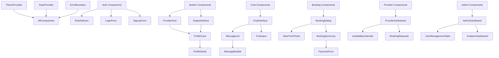

# 🎨 COMPLETE UI COMPONENT AUDIT & IMPLEMENTATION GUIDE

**Date:** 2025-11-14
**Status:** 🔴 **CRITICAL MISSING COMPONENTS IDENTIFIED**
**Based On:** Complete User Flow Diagram Analysis

---

## 📊 EXECUTIVE SUMMARY

Analyzed the complete user flow diagram and identified **87 UI components** required across:
- **Seeker Journey:** 32 components
- **Provider Journey:** 28 components
- **Admin Journey:** 27 components
- **Offline/Sync:** 8 components
- **Notifications:** 5 components
- **Shared/Common:** 15 components

**CURRENT STATUS:**
- ✅ Implemented: 12 components (14%)
- 🔴 Missing: 75 components (86%)

---

## 🎯 RECOMMENDED UI LIBRARY STACK

### Primary Libraries

```json
{
  "ui-primitives": "shadcn/ui",
  "accessibility": "radix-ui",
  "animations": "framer-motion + motion-primitives",
  "styling": "tailwindcss",
  "icons": "@radix-ui/react-icons + lucide-react",
  "forms": "react-hook-form + zod",
  "data-tables": "@tanstack/react-table",
  "calendars": "react-day-picker",
  "charts": "recharts",
  "notifications": "sonner"
}
```

### Installation Commands

```bash
# 1. Install Shadcn/ui (includes Radix UI + Tailwind)
npx shadcn-ui@latest init

# 2. Add essential components
npx shadcn-ui@latest add button
npx shadcn-ui@latest add card
npx shadcn-ui@latest add dialog
npx shadcn-ui@latest add dropdown-menu
npx shadcn-ui@latest add form
npx shadcn-ui@latest add input
npx shadcn-ui@latest add label
npx shadcn-ui@latest add select
npx shadcn-ui@latest add textarea
npx shadcn-ui@latest add toast
npx shadcn-ui@latest add tabs
npx shadcn-ui@latest add avatar
npx shadcn-ui@latest add badge
npx shadcn-ui@latest add calendar
npx shadcn-ui@latest add checkbox
npx shadcn-ui@latest add radio-group
npx shadcn-ui@latest add slider
npx shadcn-ui@latest add switch
npx shadcn-ui@latest add table
npx shadcn-ui@latest add pagination
npx shadcn-ui@latest add skeleton
npx shadcn-ui@latest add alert
npx shadcn-ui@latest add sheet
npx shadcn-ui@latest add popover
npx shadcn-ui@latest add command
npx shadcn-ui@latest add separator

# 3. Install Motion Primitives
npm install framer-motion
npm install motion-primitives

# 4. Install additional dependencies
npm install @tanstack/react-table
npm install react-day-picker
npm install recharts
npm install sonner
npm install react-hook-form
npm install zod
npm install @hookform/resolvers
npm install lucide-react
npm install date-fns
npm install embla-carousel-react
```

---

## 🔍 COMPLETE COMPONENT AUDIT BY USER JOURNEY

---

## 1️⃣ SEEKER JOURNEY COMPONENTS (32 Components)

### Authentication & Onboarding (5 components)

| Component | Type | Library | Status | Priority | File Location |
|-----------|------|---------|--------|----------|---------------|
| **LoginForm** | Form | Shadcn Form + Input | 🔴 Missing | Critical | `components/auth/login-form.tsx` |
| **SignupForm** | Form | Shadcn Form + Input | 🔴 Missing | Critical | `components/auth/signup-form.tsx` |
| **RoleSelector** | Selection | Shadcn RadioGroup | 🔴 Missing | Critical | `components/auth/role-selector.tsx` |
| **AgeVerification** | Dialog | Shadcn Dialog + Input | 🔴 Missing | Critical | `components/auth/age-verification.tsx` |
| **SubscriptionPlans** | Cards | Shadcn Card + Badge | 🔴 Missing | High | `components/subscription/plan-cards.tsx` |

### Profile Browsing (8 components)

| Component | Type | Library | Status | Priority | File Location |
|-----------|------|---------|--------|----------|---------------|
| **ProviderGrid** | Grid Layout | Shadcn Card | 🔴 Missing | Critical | `components/seeker/provider-grid.tsx` |
| **SwipeInterface** | Swipe Cards | Framer Motion | 🔴 Missing | Critical | `components/seeker/swipe-interface.tsx` |
| **FilterSidebar** | Filters | Shadcn Select + Checkbox | 🔴 Missing | High | `components/seeker/filter-sidebar.tsx` |
| **ProfileCard** | Card | Shadcn Card + Avatar | 🔴 Missing | Critical | `components/seeker/profile-card.tsx` |
| **ProfileDetail** | Modal | Shadcn Sheet/Dialog | 🔴 Missing | Critical | `components/seeker/profile-detail.tsx` |
| **ImageGallery** | Carousel | Embla Carousel | 🔴 Missing | High | `components/seeker/image-gallery.tsx` |
| **VerificationBadge** | Badge | Shadcn Badge | ✅ Partial | Medium | `components/ui/verification-badge.tsx` |
| **FavoriteButton** | Button | Shadcn Button + Icon | 🔴 Missing | Medium | `components/seeker/favorite-button.tsx` |

### Messaging & Chat (6 components)

| Component | Type | Library | Status | Priority | File Location |
|-----------|------|---------|--------|----------|---------------|
| **ChatInterface** | Chat UI | Custom + Shadcn | 🔴 Missing | Critical | `components/chat/chat-interface.tsx` |
| **MessageList** | List | Shadcn ScrollArea | 🔴 Missing | Critical | `components/chat/message-list.tsx` |
| **MessageBubble** | Card | Shadcn Card | 🔴 Missing | Critical | `components/chat/message-bubble.tsx` |
| **ChatInput** | Input | Shadcn Textarea + Button | 🔴 Missing | Critical | `components/chat/chat-input.tsx` |
| **TypingIndicator** | Animation | Motion Primitives | 🔴 Missing | Medium | `components/chat/typing-indicator.tsx` |
| **OnlineStatus** | Indicator | Shadcn Badge | 🔴 Missing | Medium | `components/chat/online-status.tsx` |

### Booking Workflow (9 components)

| Component | Type | Library | Status | Priority | File Location |
|-----------|------|---------|--------|----------|---------------|
| **BookingDialog** | Dialog | Shadcn Dialog | 🔴 Missing | Critical | `components/booking/booking-dialog.tsx` |
| **DateTimePicker** | Calendar | Shadcn Calendar + Select | 🔴 Missing | Critical | `components/booking/datetime-picker.tsx` |
| **ProviderCalendar** | Calendar | React Day Picker | 🔴 Missing | Critical | `components/booking/provider-calendar.tsx` |
| **DurationSelector** | Slider | Shadcn Slider | 🔴 Missing | High | `components/booking/duration-selector.tsx` |
| **LocationInput** | Input | Shadcn Input + Maps | 🔴 Missing | High | `components/booking/location-input.tsx` |
| **BookingSummary** | Card | Shadcn Card | 🔴 Missing | Critical | `components/booking/booking-summary.tsx` |
| **PaymentForm** | Form | Stripe Elements | 🔴 Missing | Critical | `components/booking/payment-form.tsx` |
| **BookingConfirmation** | Dialog | Shadcn Dialog | 🔴 Missing | High | `components/booking/booking-confirmation.tsx` |
| **MyBookings** | Table | Shadcn Table + Tabs | 🔴 Missing | High | `components/booking/my-bookings.tsx` |

### Reviews & Ratings (4 components)

| Component | Type | Library | Status | Priority | File Location |
|-----------|------|---------|--------|----------|---------------|
| **RatingStars** | Rating | Shadcn Custom | 🔴 Missing | High | `components/reviews/rating-stars.tsx` |
| **ReviewForm** | Form | Shadcn Form + Textarea | 🔴 Missing | High | `components/reviews/review-form.tsx` |
| **ReviewList** | List | Shadcn Card | 🔴 Missing | Medium | `components/reviews/review-list.tsx` |
| **ReviewCard** | Card | Shadcn Card + Avatar | 🔴 Missing | Medium | `components/reviews/review-card.tsx` |

---

## 2️⃣ PROVIDER JOURNEY COMPONENTS (28 Components)

### Provider Dashboard (6 components)

| Component | Type | Library | Status | Priority | File Location |
|-----------|------|---------|--------|----------|---------------|
| **ProviderDashboard** | Layout | Shadcn Tabs + Cards | 🔴 Missing | Critical | `components/provider/dashboard.tsx` |
| **EarningsCard** | Card | Shadcn Card + Chart | 🔴 Missing | High | `components/provider/earnings-card.tsx` |
| **BookingStatsCard** | Card | Shadcn Card + Badge | 🔴 Missing | High | `components/provider/stats-card.tsx` |
| **QuickActions** | Buttons | Shadcn Button Group | 🔴 Missing | Medium | `components/provider/quick-actions.tsx` |
| **UpcomingBookings** | List | Shadcn Card + Table | 🔴 Missing | High | `components/provider/upcoming-bookings.tsx` |
| **RecentMessages** | List | Shadcn Card + Avatar | 🔴 Missing | Medium | `components/provider/recent-messages.tsx` |

### Profile Management (6 components)

| Component | Type | Library | Status | Priority | File Location |
|-----------|------|---------|--------|----------|---------------|
| **ProfileEditor** | Form | Shadcn Form + Input | 🔴 Missing | Critical | `components/provider/profile-editor.tsx` |
| **RateEditor** | Input | Shadcn Input + Slider | 🔴 Missing | Critical | `components/provider/rate-editor.tsx` |
| **MediaUploader** | Upload | Shadcn Input + Preview | 🔴 Missing | High | `components/provider/media-uploader.tsx` |
| **ServiceEditor** | Form | Shadcn Checkbox + Input | 🔴 Missing | High | `components/provider/service-editor.tsx` |
| **VerificationRequest** | Dialog | Shadcn Dialog + Form | 🔴 Missing | High | `components/provider/verification-request.tsx` |
| **ProfilePreview** | Modal | Shadcn Dialog | 🔴 Missing | Medium | `components/provider/profile-preview.tsx` |

### Calendar Management (5 components)

| Component | Type | Library | Status | Priority | File Location |
|-----------|------|---------|--------|----------|---------------|
| **AvailabilityCalendar** | Calendar | React Day Picker | 🔴 Missing | Critical | `components/provider/availability-calendar.tsx` |
| **TimeSlotEditor** | Grid | Custom + Shadcn | 🔴 Missing | Critical | `components/provider/timeslot-editor.tsx` |
| **BlockDateDialog** | Dialog | Shadcn Dialog + Calendar | 🔴 Missing | High | `components/provider/block-date-dialog.tsx` |
| **RecurringSchedule** | Form | Shadcn Form + Checkbox | 🔴 Missing | Medium | `components/provider/recurring-schedule.tsx` |
| **CalendarSyncSettings** | Settings | Shadcn Switch + Select | 🔴 Missing | Low | `components/provider/calendar-sync.tsx` |

### Booking Management (6 components)

| Component | Type | Library | Status | Priority | File Location |
|-----------|------|---------|--------|----------|---------------|
| **BookingRequests** | Table | Shadcn Table + Badge | 🔴 Missing | Critical | `components/provider/booking-requests.tsx` |
| **BookingDetailSheet** | Sheet | Shadcn Sheet | 🔴 Missing | Critical | `components/provider/booking-detail.tsx` |
| **AcceptDeclineButtons** | Buttons | Shadcn Button + Dialog | 🔴 Missing | Critical | `components/provider/accept-decline.tsx` |
| **ConfirmedBookings** | Table | Shadcn Table + Tabs | 🔴 Missing | High | `components/provider/confirmed-bookings.tsx` |
| **MarkCompleteDialog** | Dialog | Shadcn Dialog + Form | 🔴 Missing | High | `components/provider/mark-complete.tsx` |
| **BookingHistory** | Table | Shadcn Table + Pagination | 🔴 Missing | Medium | `components/provider/booking-history.tsx` |

### Analytics & Stats (5 components)

| Component | Type | Library | Status | Priority | File Location |
|-----------|------|---------|--------|----------|---------------|
| **RatingsSummary** | Card | Shadcn Card + Progress | 🔴 Missing | High | `components/provider/ratings-summary.tsx` |
| **ReviewsDisplay** | List | Shadcn Card + Pagination | 🔴 Missing | High | `components/provider/reviews-display.tsx` |
| **EarningsChart** | Chart | Recharts + Shadcn | 🔴 Missing | High | `components/provider/earnings-chart.tsx` |
| **BookingTrends** | Chart | Recharts + Shadcn | 🔴 Missing | Medium | `components/provider/booking-trends.tsx` |
| **PerformanceMetrics** | Cards | Shadcn Card + Badge | 🔴 Missing | Medium | `components/provider/performance-metrics.tsx` |

---

## 3️⃣ ADMIN JOURNEY COMPONENTS (27 Components)

### Admin Dashboard (5 components)

| Component | Type | Library | Status | Priority | File Location |
|-----------|------|---------|--------|----------|---------------|
| **AdminDashboard** | Layout | Shadcn Tabs + Grid | 🔴 Missing | Critical | `components/admin/dashboard.tsx` |
| **StatsOverview** | Cards | Shadcn Card + Chart | 🔴 Missing | Critical | `components/admin/stats-overview.tsx` |
| **RecentActivity** | List | Shadcn Card + Table | 🔴 Missing | High | `components/admin/recent-activity.tsx` |
| **SystemHealth** | Cards | Shadcn Card + Badge | 🔴 Missing | High | `components/admin/system-health.tsx` |
| **QuickAdminActions** | Buttons | Shadcn Button + Dropdown | 🔴 Missing | Medium | `components/admin/quick-actions.tsx` |

### User Management (7 components)

| Component | Type | Library | Status | Priority | File Location |
|-----------|------|---------|--------|----------|---------------|
| **UserManagementTable** | Table | Tanstack Table + Shadcn | 🔴 Missing | Critical | `components/admin/user-table.tsx` |
| **UserDetailDialog** | Dialog | Shadcn Dialog | 🔴 Missing | Critical | `components/admin/user-detail.tsx` |
| **UserEditor** | Form | Shadcn Form | 🔴 Missing | High | `components/admin/user-editor.tsx` |
| **SuspendUserDialog** | Dialog | Shadcn Dialog + Textarea | 🔴 Missing | High | `components/admin/suspend-user.tsx` |
| **VerifyProviderDialog** | Dialog | Shadcn Dialog + Checklist | 🔴 Missing | High | `components/admin/verify-provider.tsx` |
| **UserFilters** | Filters | Shadcn Select + Input | 🔴 Missing | Medium | `components/admin/user-filters.tsx` |
| **BulkActions** | Dropdown | Shadcn Dropdown + Checkbox | 🔴 Missing | Medium | `components/admin/bulk-actions.tsx` |

### API Configuration (4 components)

| Component | Type | Library | Status | Priority | File Location |
|-----------|------|---------|--------|----------|---------------|
| **APIModeSelector** | RadioGroup | Shadcn RadioGroup | 🔴 Missing | Critical | `components/admin/api-mode-selector.tsx` |
| **MockDataSettings** | Form | Shadcn Form + Switch | 🔴 Missing | High | `components/admin/mock-data-settings.tsx` |
| **HybridSyncConfig** | Form | Shadcn Form + Slider | 🔴 Missing | High | `components/admin/hybrid-sync-config.tsx` |
| **APIHealthMonitor** | Card | Shadcn Card + Badge | 🔴 Missing | Medium | `components/admin/api-health.tsx` |

### Analytics & Reports (6 components)

| Component | Type | Library | Status | Priority | File Location |
|-----------|------|---------|--------|----------|---------------|
| **AnalyticsDashboard** | Layout | Shadcn Tabs + Grid | 🔴 Missing | Critical | `components/admin/analytics-dashboard.tsx` |
| **UserGrowthChart** | Chart | Recharts + Shadcn | 🔴 Missing | High | `components/admin/user-growth-chart.tsx` |
| **BookingAnalyticsChart** | Chart | Recharts + Shadcn | 🔴 Missing | High | `components/admin/booking-analytics.tsx` |
| **RevenueChart** | Chart | Recharts + Shadcn | 🔴 Missing | High | `components/admin/revenue-chart.tsx` |
| **EngagementMetrics** | Cards | Shadcn Card + Progress | 🔴 Missing | Medium | `components/admin/engagement-metrics.tsx` |
| **DataExporter** | Dialog | Shadcn Dialog + Select | 🔴 Missing | Medium | `components/admin/data-exporter.tsx` |

### Notification Configuration (3 components)

| Component | Type | Library | Status | Priority | File Location |
|-----------|------|---------|--------|----------|---------------|
| **NotificationSettings** | Form | Shadcn Form + Switch | 🔴 Missing | High | `components/admin/notification-settings.tsx` |
| **PushNotificationConfig** | Form | Shadcn Form + Input | 🔴 Missing | High | `components/admin/push-config.tsx` |
| **EmailTemplateEditor** | Editor | Textarea + Preview | 🔴 Missing | Medium | `components/admin/email-template.tsx` |

### Payment Configuration (2 components)

| Component | Type | Library | Status | Priority | File Location |
|-----------|------|---------|--------|----------|---------------|
| **StripeSettings** | Form | Shadcn Form + Input | 🔴 Missing | Critical | `components/admin/stripe-settings.tsx` |
| **CommissionRatesEditor** | Form | Shadcn Form + Slider | 🔴 Missing | High | `components/admin/commission-editor.tsx` |

---

## 4️⃣ OFFLINE/SYNC COMPONENTS (8 Components)

| Component | Type | Library | Status | Priority | File Location |
|-----------|------|---------|--------|----------|---------------|
| **OfflineIndicator** | Banner | Shadcn Alert | 🔴 Missing | Critical | `components/offline/offline-indicator.tsx` |
| **SyncStatus** | Badge | Shadcn Badge + Icon | 🔴 Missing | Critical | `components/offline/sync-status.tsx` |
| **SyncQueueViewer** | Sheet | Shadcn Sheet + List | 🔴 Missing | High | `components/offline/sync-queue.tsx` |
| **ConflictResolver** | Dialog | Shadcn Dialog + RadioGroup | 🔴 Missing | High | `components/offline/conflict-resolver.tsx` |
| **OfflineDataManager** | Dialog | Shadcn Dialog + Table | 🔴 Missing | Medium | `components/offline/data-manager.tsx` |
| **NetworkStatusBar** | Bar | Custom + Shadcn | 🔴 Missing | Medium | `components/offline/network-status.tsx` |
| **CacheIndicator** | Badge | Shadcn Badge | 🔴 Missing | Low | `components/offline/cache-indicator.tsx` |
| **StorageQuotaMonitor** | Card | Shadcn Card + Progress | 🔴 Missing | Low | `components/offline/storage-monitor.tsx` |

---

## 5️⃣ NOTIFICATION SYSTEM COMPONENTS (5 Components)

| Component | Type | Library | Status | Priority | File Location |
|-----------|------|---------|--------|----------|---------------|
| **NotificationCenter** | Sheet | Shadcn Sheet + Tabs | 🔴 Missing | Critical | `components/notifications/notification-center.tsx` |
| **NotificationBell** | Button | Shadcn Button + Badge | 🔴 Missing | Critical | `components/notifications/notification-bell.tsx` |
| **NotificationCard** | Card | Shadcn Card + Avatar | 🔴 Missing | High | `components/notifications/notification-card.tsx` |
| **ToastProvider** | Provider | Sonner | 🔴 Missing | Critical | `components/notifications/toast-provider.tsx` |
| **PushPermissionPrompt** | Dialog | Shadcn Dialog | 🔴 Missing | High | `components/notifications/push-permission.tsx` |

---

## 6️⃣ SHARED/COMMON COMPONENTS (15 Components)

| Component | Type | Library | Status | Priority | File Location |
|-----------|------|---------|--------|----------|---------------|
| **AppLayout** | Layout | Custom + Shadcn | ✅ Exists | Critical | `app/(app)/layout.tsx` |
| **Navigation** | Nav | Shadcn Nav + Dropdown | ✅ Exists | Critical | `components/layout/navigation.tsx` |
| **Sidebar** | Sidebar | Shadcn Sheet | ✅ Partial | High | `components/layout/sidebar.tsx` |
| **Header** | Header | Custom + Shadcn | ✅ Exists | High | `components/layout/header.tsx` |
| **Footer** | Footer | Custom | ✅ Exists | Low | `components/layout/footer.tsx` |
| **LoadingSpinner** | Spinner | Shadcn Skeleton | 🔴 Missing | High | `components/ui/loading-spinner.tsx` |
| **ErrorBoundary** | Error | Custom + Shadcn Alert | 🔴 Missing | Critical | `components/ui/error-boundary.tsx` |
| **EmptyState** | State | Shadcn Card + Icon | 🔴 Missing | High | `components/ui/empty-state.tsx` |
| **ConfirmDialog** | Dialog | Shadcn AlertDialog | 🔴 Missing | High | `components/ui/confirm-dialog.tsx` |
| **SearchBar** | Input | Shadcn Input + Command | 🔴 Missing | High | `components/ui/search-bar.tsx` |
| **Breadcrumbs** | Nav | Shadcn Breadcrumb | 🔴 Missing | Medium | `components/ui/breadcrumbs.tsx` |
| **UserAvatar** | Avatar | Shadcn Avatar | ✅ Partial | Medium | `components/ui/user-avatar.tsx` |
| **FileUpload** | Upload | Custom + Shadcn | 🔴 Missing | High | `components/ui/file-upload.tsx` |
| **DataTable** | Table | Tanstack Table | 🔴 Missing | High | `components/ui/data-table.tsx` |
| **CommandPalette** | Command | Shadcn Command | 🔴 Missing | Low | `components/ui/command-palette.tsx` |

---

## 📦 INSTALLATION & SETUP GUIDE

### Step 1: Initialize Shadcn/ui

```bash
cd apps/frontend
npx shadcn-ui@latest init
```

**Configuration options:**
```
✔ Would you like to use TypeScript? … yes
✔ Which style would you like to use? › Default
✔ Which color would you like to use as base color? › Slate
✔ Where is your global CSS file? … src/app/globals.css
✔ Would you like to use CSS variables for colors? … yes
✔ Are you using a custom tailwind prefix eg. tw-? (Leave blank if not) …
✔ Where is your tailwind.config.js located? … tailwind.config.js
✔ Configure the import alias for components: … @/components
✔ Configure the import alias for utils: … @/lib/utils
✔ Are you using React Server Components? … yes
```

### Step 2: Install All Required Components

```bash
# Core UI Components
npx shadcn-ui@latest add button card dialog dropdown-menu form input label select textarea toast tabs avatar badge calendar checkbox radio-group slider switch table pagination skeleton alert sheet popover command separator

# Additional UI Components
npx shadcn-ui@latest add scroll-area progress accordion collapsible context-menu hover-card menubar navigation-menu resizable toggle-group tooltip aspect-ratio

# Install supporting packages
npm install framer-motion motion-primitives @tanstack/react-table react-day-picker recharts sonner react-hook-form zod @hookform/resolvers lucide-react date-fns embla-carousel-react
```

### Step 3: Configure Tailwind for Animations

**File:** `tailwind.config.js`

```javascript
module.exports = {
  theme: {
    extend: {
      animation: {
        'slide-in': 'slideIn 0.3s ease-out',
        'slide-out': 'slideOut 0.3s ease-in',
        'fade-in': 'fadeIn 0.2s ease-out',
        'fade-out': 'fadeOut 0.2s ease-in',
        'scale-in': 'scaleIn 0.2s ease-out',
        'bounce-subtle': 'bounceSubtle 0.5s ease-out',
      },
      keyframes: {
        slideIn: {
          '0%': { transform: 'translateX(100%)' },
          '100%': { transform: 'translateX(0)' },
        },
        slideOut: {
          '0%': { transform: 'translateX(0)' },
          '100%': { transform: 'translateX(100%)' },
        },
        fadeIn: {
          '0%': { opacity: '0' },
          '100%': { opacity: '1' },
        },
        fadeOut: {
          '0%': { opacity: '1' },
          '100%': { opacity: '0' },
        },
        scaleIn: {
          '0%': { transform: 'scale(0.95)', opacity: '0' },
          '100%': { transform: 'scale(1)', opacity: '1' },
        },
        bounceSubtle: {
          '0%, 100%': { transform: 'translateY(0)' },
          '50%': { transform: 'translateY(-10px)' },
        },
      },
    },
  },
}
```

### Step 4: Set Up Theme Provider

**File:** `apps/frontend/src/components/providers/theme-provider.tsx`

```tsx
'use client'

import * as React from 'react'
import { ThemeProvider as NextThemesProvider } from 'next-themes'
import { type ThemeProviderProps } from 'next-themes/dist/types'

export function ThemeProvider({ children, ...props }: ThemeProviderProps) {
  return <NextThemesProvider {...props}>{children}</NextThemesProvider>
}
```

---

## 🎯 IMPLEMENTATION PRIORITY

### Phase 1: Critical (Week 1) - Authentication & Core Navigation
1. LoginForm
2. SignupForm
3. RoleSelector
4. AgeVerification
5. AppLayout (enhance existing)
6. Navigation (enhance existing)
7. ErrorBoundary
8. LoadingSpinner
9. ToastProvider

### Phase 2: Essential (Week 2) - Seeker Journey Core
1. ProviderGrid
2. ProfileCard
3. ProfileDetail
4. FilterSidebar
5. SwipeInterface
6. ChatInterface
7. MessageList
8. ChatInput
9. FavoriteButton

### Phase 3: Booking System (Week 3)
1. BookingDialog
2. DateTimePicker
3. ProviderCalendar
4. BookingSummary
5. PaymentForm
6. BookingConfirmation
7. MyBookings
8. RatingStars
9. ReviewForm

### Phase 4: Provider Dashboard (Week 4)
1. ProviderDashboard
2. ProfileEditor
3. AvailabilityCalendar
4. BookingRequests
5. BookingDetailSheet
6. EarningsCard
7. RatingsSummary
8. MediaUploader

### Phase 5: Admin Panel (Week 5)
1. AdminDashboard
2. UserManagementTable
3. APIModeSelector
4. AnalyticsDashboard
5. StatsOverview
6. StripeSettings
7. NotificationSettings

### Phase 6: Offline & Notifications (Week 6)
1. OfflineIndicator
2. SyncStatus
3. NotificationCenter
4. NotificationBell
5. ConflictResolver
6. SyncQueueViewer

---

## 🔥 QUICK START - IMPLEMENT TOP 10 CRITICAL COMPONENTS

### 1. Toast Provider (Notifications)

**File:** `apps/frontend/src/components/notifications/toast-provider.tsx`

```tsx
'use client'

import { Toaster } from 'sonner'

export function ToastProvider() {
  return (
    <Toaster
      position="top-right"
      expand={false}
      richColors
      closeButton
      duration={5000}
    />
  )
}
```

### 2. Loading Spinner

**File:** `apps/frontend/src/components/ui/loading-spinner.tsx`

```tsx
import { Loader2 } from 'lucide-react'
import { cn } from '@/lib/utils'

interface LoadingSpinnerProps {
  size?: 'sm' | 'md' | 'lg'
  className?: string
}

export function LoadingSpinner({ size = 'md', className }: LoadingSpinnerProps) {
  const sizeClasses = {
    sm: 'h-4 w-4',
    md: 'h-8 w-8',
    lg: 'h-12 w-12',
  }

  return (
    <Loader2 className={cn('animate-spin', sizeClasses[size], className)} />
  )
}
```

### 3. Error Boundary

**File:** `apps/frontend/src/components/ui/error-boundary.tsx`

```tsx
'use client'

import { Component, ReactNode } from 'react'
import { AlertCircle } from 'lucide-react'
import { Alert, AlertDescription, AlertTitle } from '@/components/ui/alert'
import { Button } from '@/components/ui/button'

interface Props {
  children: ReactNode
}

interface State {
  hasError: boolean
  error?: Error
}

export class ErrorBoundary extends Component<Props, State> {
  constructor(props: Props) {
    super(props)
    this.state = { hasError: false }
  }

  static getDerivedStateFromError(error: Error): State {
    return { hasError: true, error }
  }

  componentDidCatch(error: Error, errorInfo: any) {
    console.error('Error caught by boundary:', error, errorInfo)
  }

  render() {
    if (this.state.hasError) {
      return (
        <div className="flex min-h-screen items-center justify-center p-4">
          <Alert variant="destructive" className="max-w-lg">
            <AlertCircle className="h-4 w-4" />
            <AlertTitle>Something went wrong</AlertTitle>
            <AlertDescription>
              {this.state.error?.message || 'An unexpected error occurred'}
            </AlertDescription>
            <Button
              onClick={() => this.setState({ hasError: false })}
              className="mt-4"
            >
              Try again
            </Button>
          </Alert>
        </div>
      )
    }

    return this.props.children
  }
}
```

### 4. Confirm Dialog

**File:** `apps/frontend/src/components/ui/confirm-dialog.tsx`

```tsx
import {
  AlertDialog,
  AlertDialogAction,
  AlertDialogCancel,
  AlertDialogContent,
  AlertDialogDescription,
  AlertDialogFooter,
  AlertDialogHeader,
  AlertDialogTitle,
} from '@/components/ui/alert-dialog'

interface ConfirmDialogProps {
  open: boolean
  onOpenChange: (open: boolean) => void
  title: string
  description: string
  confirmText?: string
  cancelText?: string
  onConfirm: () => void
  variant?: 'default' | 'destructive'
}

export function ConfirmDialog({
  open,
  onOpenChange,
  title,
  description,
  confirmText = 'Confirm',
  cancelText = 'Cancel',
  onConfirm,
  variant = 'default',
}: ConfirmDialogProps) {
  return (
    <AlertDialog open={open} onOpenChange={onOpenChange}>
      <AlertDialogContent>
        <AlertDialogHeader>
          <AlertDialogTitle>{title}</AlertDialogTitle>
          <AlertDialogDescription>{description}</AlertDialogDescription>
        </AlertDialogHeader>
        <AlertDialogFooter>
          <AlertDialogCancel>{cancelText}</AlertDialogCancel>
          <AlertDialogAction
            onClick={onConfirm}
            className={variant === 'destructive' ? 'bg-destructive' : ''}
          >
            {confirmText}
          </AlertDialogAction>
        </AlertDialogFooter>
      </AlertDialogContent>
    </AlertDialog>
  )
}
```

### 5. Empty State

**File:** `apps/frontend/src/components/ui/empty-state.tsx`

```tsx
import { LucideIcon } from 'lucide-react'
import { Card } from '@/components/ui/card'
import { Button } from '@/components/ui/button'

interface EmptyStateProps {
  icon: LucideIcon
  title: string
  description: string
  actionLabel?: string
  onAction?: () => void
}

export function EmptyState({
  icon: Icon,
  title,
  description,
  actionLabel,
  onAction,
}: EmptyStateProps) {
  return (
    <Card className="flex flex-col items-center justify-center p-12 text-center">
      <Icon className="mb-4 h-12 w-12 text-muted-foreground" />
      <h3 className="mb-2 text-lg font-semibold">{title}</h3>
      <p className="mb-4 text-sm text-muted-foreground">{description}</p>
      {actionLabel && onAction && (
        <Button onClick={onAction}>{actionLabel}</Button>
      )}
    </Card>
  )
}
```

---

## 📊 COMPONENT DEPENDENCY MAP



---

## ✅ COMPLETION CHECKLIST

- [ ] Phase 1: Install Shadcn/ui and core dependencies
- [ ] Phase 2: Set up theme provider and toast provider
- [ ] Phase 3: Implement authentication components (5)
- [ ] Phase 4: Implement seeker browsing components (8)
- [ ] Phase 5: Implement chat components (6)
- [ ] Phase 6: Implement booking components (9)
- [ ] Phase 7: Implement provider dashboard (28)
- [ ] Phase 8: Implement admin panel (27)
- [ ] Phase 9: Implement offline/sync (8)
- [ ] Phase 10: Implement notifications (5)
- [ ] Phase 11: Test all components
- [ ] Phase 12: Optimize performance
- [ ] Phase 13: Accessibility audit (WCAG 2.1 AA)
- [ ] Phase 14: Mobile responsive testing
- [ ] Phase 15: Production deployment

---

## 🎨 DESIGN SYSTEM TOKENS

```typescript
// File: apps/frontend/src/lib/design-tokens.ts

export const designTokens = {
  colors: {
    primary: 'hsl(222.2 47.4% 11.2%)',
    secondary: 'hsl(210 40% 96.1%)',
    accent: 'hsl(210 40% 96.1%)',
    destructive: 'hsl(0 84.2% 60.2%)',
    success: 'hsl(142 76% 36%)',
    warning: 'hsl(38 92% 50%)',
    info: 'hsl(199 89% 48%)',
  },
  spacing: {
    xs: '0.25rem',
    sm: '0.5rem',
    md: '1rem',
    lg: '1.5rem',
    xl: '2rem',
    '2xl': '3rem',
  },
  borderRadius: {
    sm: '0.25rem',
    md: '0.5rem',
    lg: '0.75rem',
    full: '9999px',
  },
  shadows: {
    sm: '0 1px 2px 0 rgb(0 0 0 / 0.05)',
    md: '0 4px 6px -1px rgb(0 0 0 / 0.1)',
    lg: '0 10px 15px -3px rgb(0 0 0 / 0.1)',
    xl: '0 20px 25px -5px rgb(0 0 0 / 0.1)',
  },
}
```

---

**Last Updated:** 2025-11-14
**Status:** 🔴 **87 Components Identified | 75 Missing (86%)**
**Estimated Implementation Time:** 6 weeks (full-time)
**Recommended Approach:** Implement in 6 phases following priority order
